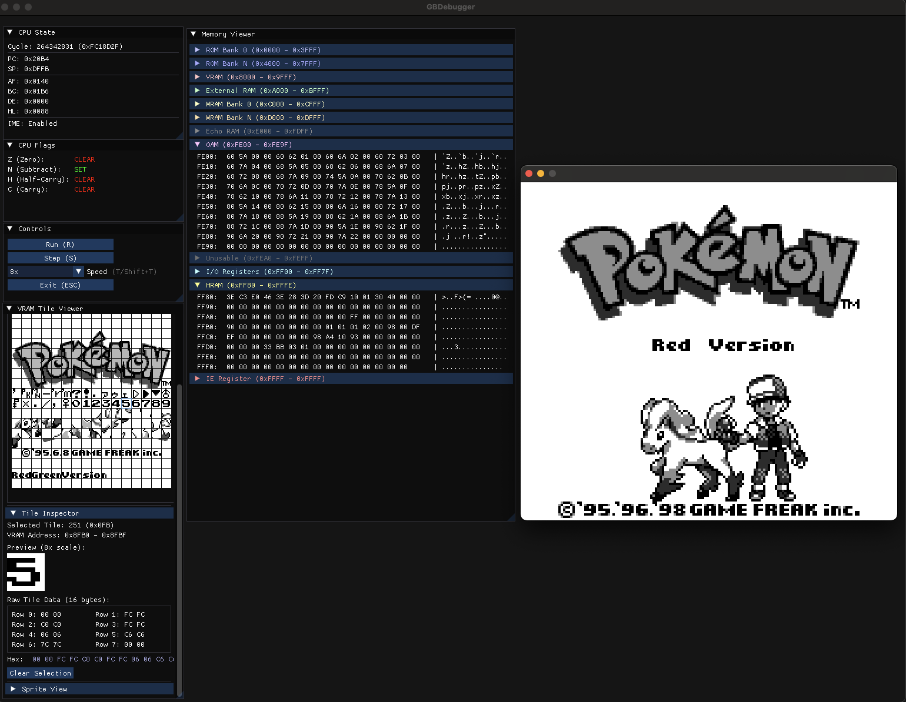

# GBDebugger

An emulator-agnostic GameBoy debugger library using Dear ImGui.



## Overview

GBDebugger provides a graphical debugging interface for GameBoy emulators. It displays CPU state, registers, flags, and memory contents in real-time. The library is designed to work with any GameBoy emulator through a simple, standard C++ API.

## Features

- **CPU State Display**: View cycle count, PC, SP, and all register pairs (AF, BC, DE, HL)
- **Flag Visualization**: Clear display of Z, N, H, C flags
- **Memory Viewer**: Hex dump of the full 64KB address space with ASCII representation
- **Memory Map Segmentation**: Visual separation of GameBoy memory regions
- **VRAM Viewer**: Visual tile display with palette support (DMG and CGB)
- **Memory Bank Viewing**: Inspect individual ROM, RAM, and VRAM banks independently
- **Emulator-Agnostic**: Works with any emulator through standard C++ types

## Building

GBDebugger uses CMake and automatically fetches ImGui as a dependency.

```bash
mkdir build
cd build
cmake ..
make
```

## Usage

### Basic Usage

```cpp
#include "GBDebugger.h"

// Create debugger instance
GBDebug::GBDebugger debugger;

// Open the debugger window
if (debugger.Open()) {
    // Update CPU state each cycle
    debugger.UpdateCPU(cycle, pc, sp, af, bc, de, hl, ime);
    
    // Update memory periodically
    debugger.UpdateMemory(memory_buffer, 65536);
    
    // Render each frame
    debugger.Render();
}

// Close when done
debugger.Close();
```

### Memory Bank Viewing

GBDebugger supports viewing individual memory banks independently of what is currently mapped into the GameBoy's address space. This is essential for debugging bank-switched games.

```cpp
#include "GBDebugger.h"

GBDebug::GBDebugger debugger;
debugger.Open();

// --- VRAM Banks (CGB has 2 banks of 8KB each) ---
// Pass pointers to VRAM bank data
debugger.SetVRAMBank(0, vramBank0Pointer);  // 8KB
debugger.SetVRAMBank(1, vramBank1Pointer);  // 8KB (CGB only)

// --- ROM Banks (up to 512 banks of 16KB each) ---
// Pass ROM bank count and a getter function
debugger.SetROMBanks(romBankCount, 
    [&cartridge](uint16_t bank) -> const uint8_t* {
        return cartridge.GetROMBank(bank);
    });

// --- RAM Banks (up to 16 banks, size varies by MBC) ---
// Pass RAM bank count, size, and a getter function
debugger.SetRAMBanks(ramBankCount, ramBankSize,
    [&cartridge](uint8_t bank) -> const uint8_t* {
        return cartridge.GetRAMBank(bank);
    });

// In your main loop
while (running) {
    // Update state
    debugger.UpdateCPU(cycle, pc, sp, af, bc, de, hl, ime);
    debugger.UpdateMemory(memory_buffer, 65536);
    
    // VRAM banks should be updated each frame (they can change)
    debugger.SetVRAMBank(0, gameboy.GetVRAMBank(0));
    debugger.SetVRAMBank(1, gameboy.GetVRAMBank(1));
    
    // ROM/RAM banks typically only need to be set once at cartridge load
    
    debugger.Render();
}

// Clear bank data when unloading a cartridge
debugger.ClearBankData();
```

### Integration with GBLib

If you're using GBLib as your emulator core, integration is straightforward:

```cpp
#include "GBDebugger.h"
#include "GameBoy.h"

GBDebug::GBDebugger debugger;
GameBoy gameboy;

// After loading a ROM
debugger.SetROMBanks(gameboy.GetROMBankCount(),
    [&gameboy](uint16_t bank) { return gameboy.GetROMBank(bank); });

debugger.SetRAMBanks(gameboy.GetRAMBankCount(), gameboy.GetRAMBankSize(),
    [&gameboy](uint8_t bank) { return gameboy.GetRAMBank(bank); });

// In your main loop
while (running) {
    gameboy.RunFrame();
    
    debugger.UpdateCPU(/* ... */);
    debugger.UpdateMemory(/* ... */);
    
    // Update VRAM banks each frame
    debugger.SetVRAMBank(0, gameboy.GetVRAMBank(0));
    debugger.SetVRAMBank(1, gameboy.GetVRAMBank(1));
    
    debugger.Render();
}
```

## API Reference

### Lifecycle Methods

- `bool Open()` - Initialize and open the debugger window
- `void Close()` - Close the debugger and cleanup resources
- `bool IsOpen()` - Check if the debugger is currently open

### State Update Methods

- `void UpdateCPU(...)` - Update CPU state with current register values
- `bool UpdateMemory(const uint8_t* buffer, size_t size)` - Update memory contents
- `bool UpdateColorRAM(const uint8_t* bgPaletteRAM, const uint8_t* objPaletteRAM)` - Update CGB palette RAM

### Bank Data Methods

These methods allow inspection of individual memory banks. The debugger does **not** take ownership of the provided memory - the caller retains ownership and must ensure pointers remain valid.

- `bool SetVRAMBank(uint8_t bank, const uint8_t* data)` - Set VRAM bank data (8KB per bank)
  - `bank`: Bank number (0 or 1)
  - `data`: Pointer to 8192-byte VRAM bank
  - Returns `true` on success, `false` if bank number is invalid

- `bool SetROMBanks(uint16_t count, std::function<const uint8_t*(uint16_t)> getBankFunc)` - Set ROM bank data
  - `count`: Number of ROM banks (1-512)
  - `getBankFunc`: Function that returns pointer to bank N (16KB each)
  - Returns `true` on success, `false` if count is invalid

- `bool SetRAMBanks(uint8_t count, size_t bankSize, std::function<const uint8_t*(uint8_t)> getBankFunc)` - Set RAM bank data
  - `count`: Number of RAM banks (0-16)
  - `bankSize`: Size of each RAM bank in bytes
  - `getBankFunc`: Function that returns pointer to bank N
  - Returns `true` on success, `false` if count is invalid

- `void ClearBankData()` - Clear all bank data and revert to mapped memory only

### Rendering

- `void Render()` - Render the debugger UI (call each frame)

## Bank Selection UI

When bank data is provided, the debugger UI displays bank selection dropdowns:

### VRAM Viewer
- Shows dropdown with options: "Mapped Memory", "Bank 0", "Bank 1"
- Allows viewing tiles from either VRAM bank or the currently mapped memory
- Bank 1 option only available when VRAM bank 1 data is provided (CGB mode)

### Memory Viewer
- **VRAM Region (0x8000-0x9FFF)**: Dropdown to select VRAM bank
- **ROM Bank Region (0x4000-0x7FFF)**: Dropdown to select any ROM bank
- **RAM Region (0xA000-0xBFFF)**: Dropdown to select any RAM bank
- Each region shows "Mapped Memory" option plus available bank numbers

## Backward Compatibility

The bank data API is fully backward compatible:

- **If bank data methods are not called**, the debugger functions exactly as before
- **Bank selection dropdowns are hidden** when bank data is not provided
- **Existing integrations continue to work** without any code changes
- **The debugger gracefully handles nullptr** for bank data

This means you can upgrade to the new version without modifying your existing code, and add bank viewing support incrementally.

## Memory Ownership

The bank data API uses a **non-owning pointer** design:

- The debugger stores pointers to your bank data, it does **not** copy the data
- You (the caller) retain ownership of all memory
- You must ensure pointers remain valid while the debugger is using them
- Call `ClearBankData()` before freeing bank memory, or simply close the debugger

This design ensures:
- Zero-copy performance (no unnecessary memory allocations)
- Clear ownership semantics
- Compatibility with any memory management strategy

## Requirements

- C++11 or later
- CMake 3.9 or later
- ImGui (automatically fetched)

## License

See LICENSE file for details.
